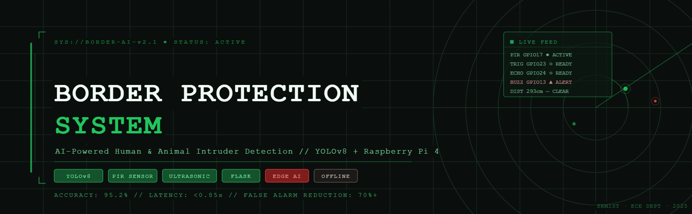
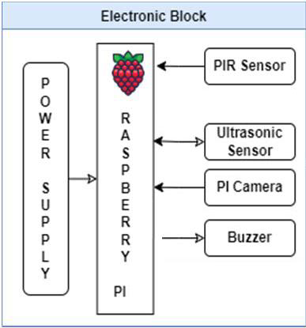
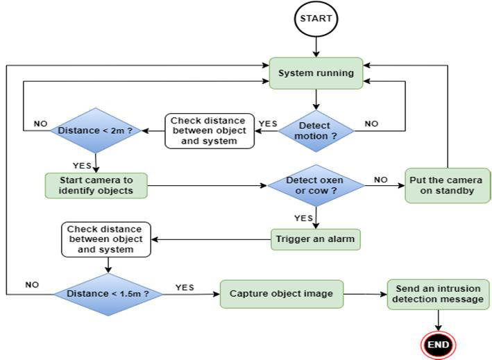
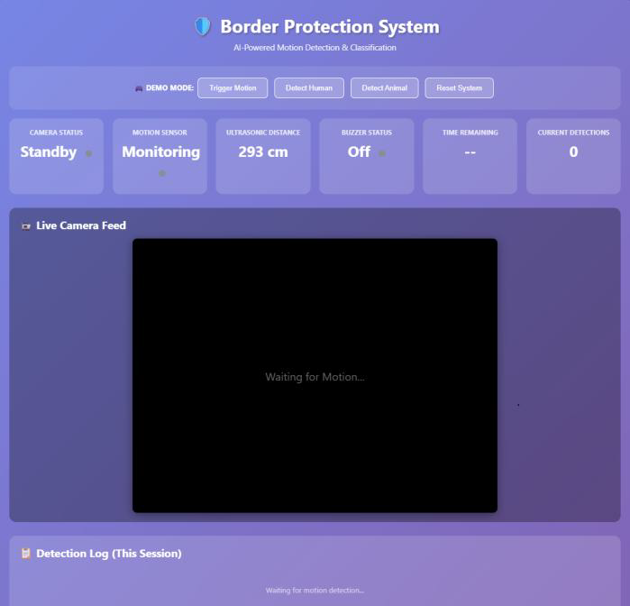

<div align="center">

<!-- 📌 IMAGE — Banner (1280×400px, dark military/tech aesthetic)
     Design in Canva: dark green/black tones, radar overlay, project title
     Save as: assets/banner.png  (create assets/ folder in repo root) -->


# 🛡️ Human & Animal Intruder Border Detection System

**AI-Powered Edge Surveillance using YOLOv8 + Raspberry Pi**

[](https://python.org)
[](https://ultralytics.com)
[](https://flask.palletsprojects.com)
[](https://raspberrypi.org)
[](https://opencv.org)
[](#-publication)
[](LICENSE)

> *A low-cost, offline-capable border surveillance system that classifies intruders as **human** or **animal** in real time using dual-sensor fusion and edge AI — achieving **95.2% detection accuracy** with **sub-second alert latency**.*

</div>

---

## 📌 Table of Contents

- [Overview](#-overview)
- [System Architecture](#-system-architecture)
- [Hardware Components](#-hardware-components)
- [Software Stack](#-software-stack)
- [How It Works](#-how-it-works)
- [Flask Web Dashboard](#-flask-web-dashboard)
- [Configuration](#-configuration)
- [Results & Performance](#-results--performance)
- [Project Structure](#-project-structure)
- [Installation & Setup](#-installation--setup)
- [Image Guide](#-image-guide--where-to-add-photos)
- [Publication](#-publication)
- [Authors](#-authors)
- [Future Work](#-future-work)

---

## 🔍 Overview

Traditional border security systems (CCTV, infrared/vibration sensors) suffer from high false alarm rates and expensive maintenance. This project proposes an intelligent, **offline-first** alternative built on a Raspberry Pi 4 that:

- Uses **dual-sensor fusion** — PIR (infrared motion) + Ultrasonic (distance) — to trigger detection only on real events, drastically cutting false positives
- Deploys **YOLOv8-tiny** fully on-device with no cloud dependency
- Classifies detected objects as **Human** (COCO class 0) or **Animal** (COCO classes 14–23) in real time
- Fires a **buzzer alert** (once per session) exclusively for human intruders via a dedicated non-blocking thread
- Logs all events with millisecond-precision timestamps to a **live Flask web dashboard**
- Keeps the camera **off by default** — activates for exactly 10 seconds on motion, then auto-releases to save power

The ultrasonic sensor specifically counters adversarial PIR-bypass attempts (e.g. reflective materials like aluminium foil), making the system robust against deliberate evasion.

---

## 🏗️ System Architecture

<!-- 📌 IMAGE — Architecture Block Diagram (800×500px)
     Use Fig1 from the IEEE paper or redraw it cleanly
     Save as: assets/architecture.png -->
<div align="center">


*Fig 1: Electronic block diagram — Power Supply → Raspberry Pi 4 → PIR Sensor, Ultrasonic Sensor, Pi/USB Camera, Buzzer*
</div>

```
┌─────────────────────────────────────────────────────────────────────┐
│                        RASPBERRY PI 4                               │
│                   (Main Processing Unit)                            │
│                                                                     │
│  ┌─────────────┐     ┌──────────────┐                               │
│  │ PIR Sensor  │────▶│  GPIO 17     │──┐                            │
│  │ (GPIO 17)   │     │  Motion Trig │  │                            │
│  └─────────────┘     └──────────────┘  │   ┌────────────────────┐  │
│                                        ├──▶│ Camera (USB / Pi)  │  │
│  ┌─────────────┐     ┌──────────────┐  │   │ 640×480 @ 30 FPS   │  │
│  │  Ultrasonic │────▶│ TRIG: GPIO23 │──┘   └─────────┬──────────┘  │
│  │ HC-SR04     │     │ ECHO: GPIO24 │                │             │
│  └─────────────┘     └──────────────┘                ▼             │
│                       dist < 300 cm?        ┌─────────────────┐    │
│                                             │  YOLOv8n.pt     │    │
│                                             │  Inference      │    │
│                                             │  conf ≥ 0.50    │    │
│                                             └────────┬────────┘    │
│                                                      │             │
│                               ┌──────────────────────┤             │
│                               ▼                      ▼             │
│                    ┌─────────────────┐   ┌───────────────────────┐ │
│                    │ HUMAN detected  │   │ ANIMAL detected       │ │
│                    │ → Buzzer GPIO13 │   │ → Log only (no alert) │ │
│                    │ → Flask log     │   │ → Flask log           │ │
│                    └─────────────────┘   └───────────────────────┘ │
└─────────────────────────────────────────────────────────────────────┘
```

**Three concurrent threads run in parallel:**
| Thread | Function | Interval |
|--------|----------|----------|
| `monitor_pir` | Polls GPIO 17 for PIR state | 100 ms |
| `monitor_ultrasonic` | Measures HC-SR04 distance | 200 ms |
| `continuous_detection` | Runs YOLOv8 on live frames | 500 ms |

---

## 🔧 Hardware Components

| Component | Model | GPIO Pins | Role |
|-----------|-------|-----------|------|
| **Raspberry Pi 4B** | 4 GB RAM | — | Main processing unit |
| **PIR Sensor** | HC-SR501 | GPIO **17** (IN) | Primary infrared motion trigger |
| **Ultrasonic Sensor** | HC-SR04 | TRIG: GPIO **23**, ECHO: GPIO **24** | Backup proximity trigger; anti-evasion |
| **USB / Pi Camera** | 5 MP | USB / CSI | Image capture (640×480 @ 30 FPS) |
| **Buzzer** | Active buzzer | GPIO **13** (OUT) | Human-detection audible alert |
| **Power Supply** | 5V 3A USB-C | — | Powers all components |

> ⚠️ **Important:** Use a voltage divider on the HC-SR04 ECHO pin. The sensor outputs 5V but Raspberry Pi GPIO only tolerates 3.3V. A simple 1kΩ + 2kΩ divider works.

<!-- 📌 IMAGE — Working Model Outdoor Photo
     Use Fig3 from the IEEE paper (assembled prototype in field/outdoor setting)
     Save as: assets/working_model.jpg -->
<div align="center">


*Fig 3: Working model tested in outdoor environment*
</div>

---

## 💻 Software Stack

| Library | Version | Purpose |
|---------|---------|---------|
| `ultralytics` | ≥ 8.0 | YOLOv8 model loading and inference |
| `opencv-python` | ≥ 4.8 | Frame capture, annotation, MJPEG encoding |
| `flask` | ≥ 3.0 | Web dashboard, `/video_feed`, `/status` API |
| `RPi.GPIO` | ≥ 0.7 | GPIO control for PIR, ultrasonic, buzzer |
| `numpy` | ≥ 1.24 | Black-frame generation for standby state |
| `threading` | stdlib | Concurrent sensor + detection threads |

**YOLOv8 COCO Classes used:**
```python
HUMAN_CLASSES  = [0]                            # person
ANIMAL_CLASSES = [14,15,16,17,18,19,20,21,22,23] # bird,cat,dog,horse,sheep,
                                                  # cow,elephant,bear,zebra,giraffe
```

---

## ⚙️ How It Works

<!-- 📌 IMAGE — Flowchart (500×700px)
     Use Fig4 from the paper (System Operations Steps flowchart) — clean PNG export
     Save as: assets/flowchart.png -->
<div align="center">


*Fig 4: System operation flowchart — startup → motion trigger → YOLOv8 → alert*
</div>

**Step-by-step pipeline:**

**1. Idle / Standby**
- Camera is `OFF`. PIR and Ultrasonic threads continuously poll at 100 ms and 200 ms respectively.
- Flask dashboard displays a black "Waiting for Motion..." frame.

**2. Motion Trigger**
- **PIR fires** (`GPIO 17 == HIGH`) → `motion_trigger_source = "PIR"`
- **Ultrasonic fires** (`distance < 300 cm`) → `motion_trigger_source = "Ultrasonic"`
- If both fire simultaneously → `motion_trigger_source = "Both"`

**3. Camera Activation**
- `cv2.VideoCapture(0)` initializes at 640×480 @ 30 FPS
- `camera_end_time = now + 10 seconds` — camera auto-releases after the window

**4. YOLOv8 Inference** (every 500 ms in `continuous_detection`)
```python
results = model(frame, conf=0.5, verbose=False)
# Humans → red bbox    Animals → yellow bbox
```

**5. Alert & Logging**
- 🔴 **Human:** Buzzer fires once per session (non-blocking thread on GPIO 13 for 2 s) + timestamped entry added to `detection_log`
- 🟡 **Animal:** Silent log entry only
- Both: Flask `/status` JSON endpoint updates every 500 ms

**6. Camera Deactivation**
- After 10 s, summary is printed to console, `camera.release()` called, system returns to standby

---

## 🌐 Flask Web Dashboard

<!-- 📌 IMAGE — Dashboard Screenshot (1280×800px full browser screenshot)
     Use Fig2 from the paper as reference
     Save as: assets/dashboard.png -->
<div align="center">


*Fig 5: Flask web dashboard — live MJPEG stream, 6-panel sensor status, timestamped detection log*
</div>

**Dashboard routes:**

| Route | Method | Description |
|-------|--------|-------------|
| `/` | GET | Main dashboard HTML (rendered via `render_template_string`) |
| `/video_feed` | GET | MJPEG live stream (`multipart/x-mixed-replace`) |
| `/status` | GET | JSON status — camera, motion, distance, buzzer, detections |

**Status panel cards (auto-refresh every 500 ms):**
- 📹 **Camera Status** — `ACTIVE` (pulsing green) / `Standby`
- 📡 **Motion Sensor** — `DETECTED` with trigger source (`PIR` / `Ultrasonic` / `Both`)
- 📏 **Ultrasonic Distance** — live cm reading (red < 100 cm, yellow < 200 cm, white otherwise)
- 🔔 **Buzzer Status** — `ACTIVE` (pulsing) / `Off`
- ⏱️ **Time Remaining** — countdown seconds for current camera window
- 🎯 **Current Detections** — count in current frame

**Detection log:**
- Human entries: red left-border card with `⚠️ HUMAN` label + confidence % + timestamp
- Animal entries: yellow left-border card with `🦌 ANIMAL` label
- Session stats bar: total Humans / Animals / Total detections

---

## 🔧 Configuration

All tunable parameters are at the top of `border_protection.py`:

```python
# GPIO Pins
PIR_PIN              = 17    # PIR sensor
ULTRASONIC_TRIG      = 23    # HC-SR04 trigger
ULTRASONIC_ECHO      = 24    # HC-SR04 echo (use voltage divider!)
BUZZER_PIN           = 13    # Active buzzer

# Camera
CAMERA_INDEX         = 0     # 0 = USB webcam, change for Pi Camera

# Detection
CONFIDENCE_THRESHOLD = 0.5   # YOLOv8 minimum confidence (0.0–1.0)
CAMERA_ACTIVE_DURATION = 10  # Seconds camera stays on after motion
ULTRASONIC_THRESHOLD = 300   # Trigger distance in cm (max useful range ~300 cm)
BUZZER_DURATION      = 2     # Buzzer beep duration in seconds
```

---

## 📊 Results & Performance

| Metric | Value |
|--------|-------|
| Human Detection Accuracy | **95.2%** |
| Animal Detection Accuracy | **91.2%** |
| YOLOv8-tiny vs MobileNetV2 | **95.2% vs 93.8%** |
| Average Detection-to-Alert Latency | **< 0.85 seconds** |
| Full Detection Cycle (motion → buzzer) | **< 1 second** |
| False Alarm Reduction (vs PIR-only) | **> 70%** |
| Idle Power Consumption | **3.8 W** |
| Active Power Consumption | **6.1 W** |
| Internet Dependency | **None (fully offline)** |
| Supported Power Source | Battery / Solar |

> Tested both indoors and outdoors on a Raspberry Pi 4 with PIR + ultrasonic sensors and a 5 MP USB camera. Python 3.9, OpenCV 4.x, YOLOv8-tiny.

---

## 📁 Project Structure

```
HUMAN-AND-ANIMAL-INTRUDER-BORDER-DETECTION-SYSTEM-/
│
├── border_protection.py       # Main application
│   ├── GPIO setup             #   PIR (17), Ultrasonic (23/24), Buzzer (13)
│   ├── get_distance()         #   HC-SR04 pulse measurement
│   ├── activate_buzzer()      #   Non-blocking buzzer thread
│   ├── analyze_frame()        #   YOLOv8 inference + bbox annotation
│   ├── monitor_pir()          #   PIR polling thread (100 ms)
│   ├── monitor_ultrasonic()   #   Ultrasonic polling thread (200 ms)
│   ├── continuous_detection() #   Frame analysis thread (500 ms)
│   ├── generate_frames()      #   MJPEG stream generator (~30 FPS)
│   ├── HTML_TEMPLATE          #   Inline Flask dashboard (CSS + JS)
│   └── Flask routes           #   /, /video_feed, /status
│
├── assets/                    # 📌 Add your images here (see Image Guide)
│   ├── banner.png             #   Project banner (1280×400px)
│   ├── architecture.png       #   Block diagram — Fig1 from paper
│   ├── working_model.jpg      #   Outdoor prototype — Fig3 from paper
│   ├── flowchart.png          #   Operation flowchart — Fig4 from paper
│   └── dashboard.png          #   Dashboard screenshot — Fig2 from paper
│
├── yolov8n.pt                 # YOLOv8-nano weights (auto-downloaded on first run)
├── README.md
└── requirements.txt
```

---

## 🚀 Installation & Setup

### Prerequisites

- Raspberry Pi 4 (4 GB RAM recommended) running **Raspberry Pi OS (64-bit)**
- Python **3.9+**
- USB camera **or** Pi Camera Module connected
- Hardware wired per GPIO table above

### 1. Clone the Repository

```bash
git clone https://github.com/AmitC04/HUMAN-AND-ANIMAL-INTRUDER-BORDER-DETECTION-SYSTEM-.git
cd HUMAN-AND-ANIMAL-INTRUDER-BORDER-DETECTION-SYSTEM-
```

### 2. Install Dependencies

```bash
pip install ultralytics opencv-python flask RPi.GPIO numpy
```

Or using a requirements file:

```bash
# Create requirements.txt
echo "ultralytics>=8.0
opencv-python>=4.8
flask>=3.0
RPi.GPIO>=0.7
numpy>=1.24" > requirements.txt

pip install -r requirements.txt
```

### 3. YOLOv8 Weights

The `yolov8n.pt` weights **download automatically** on first run. To pre-download:

```bash
python -c "from ultralytics import YOLO; YOLO('yolov8n.pt')"
```

### 4. Run the System

```bash
python border_protection.py
```

On startup you will see:
```
============================================================
🛡️  BORDER PROTECTION SYSTEM - ENHANCED
============================================================
PIR Sensor Pin:          GPIO 17
Ultrasonic TRIG Pin:     GPIO 23
Ultrasonic ECHO Pin:     GPIO 24
Buzzer Pin:              GPIO 13
Camera Active Duration:  10 seconds
Ultrasonic Threshold:    300 cm
Loading YOLOv8 model...
============================================================

🌐 Web Interface Available at:
   → http://192.168.x.x:5000
   → http://localhost:5000
```

### 5. Access the Dashboard

Open any browser on the same network:
```
http://<raspberry-pi-ip>:5000
```

Stop with `Ctrl+C` — GPIO cleanup and camera release happen automatically.


## 📄 Publication

> **"Human and Animal Border Intruder Detection System"**
> Dr. Bharatha Babu · Amit Chauhan · Lakshita
> *IEEE Paper — Department of Electronics and Communication Engineering,
> SRM Institute of Science and Technology, Kattankulathur, Chennai, India*

---

## 👥 Authors

| Name | Role | Email |
|------|------|-------|
| **Amit Chauhan** | Student, B.Tech ECE | ac2848@srmist.edu.in |
| **Lakshita** | Student, B.Tech ECE | ls2725@srmist.edu.in |
| **Dr. Bharatha Babu** | Faculty Guide | bharathb3@srmist.edu.in |

*SRM Institute of Science and Technology · Kattankulathur Campus · Chennai, India*

---

## 🔮 Future Work

- 📡 **LoRa Communication** — Network multiple nodes over a large perimeter area
- 🌙 **Thermal Camera** — Night-vision detection in total darkness
- 🧠 **Adaptive Learning** — Environment-specific model fine-tuning
- 🗺️ **Multi-Node Deployment** — Distributed monitoring with a centralized dashboard
- ☀️ **Solar Power** — Fully off-grid deployment

---

<div align="center">

**⭐ Star this repo if you found it useful!**

*Built with ❤️ at SRMIST Chennai · ECE Department · 2024–25*

</div>
